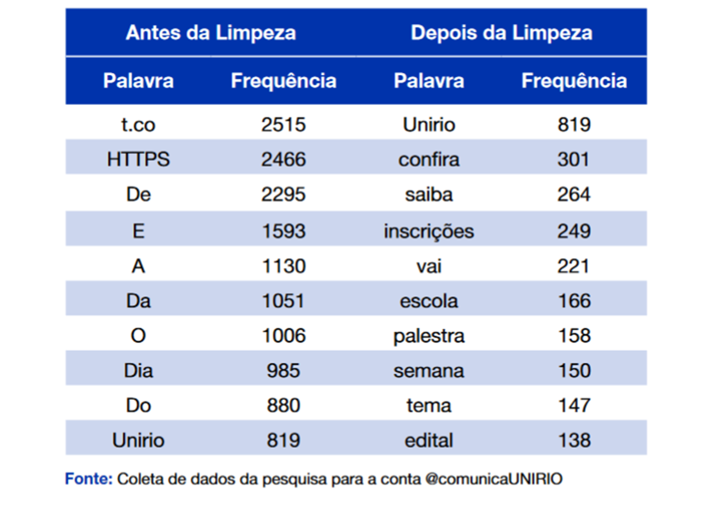

```{css, echo=FALSE}
@import url('https://fonts.googleapis.com/css?family=Chilanka&display=swap');
@import url('https://fonts.googleapis.com/css2?family=Gloria+Hallelujah&display=swap');
body {
  color: #1e666b;
  font-family: 'Chilanka', cursive;
  font-size: 22px;
}

.myfont {
  color: #1e666b;
  font-family: 'Gloria Hallelujah', cursive;
  font-size: 80px;
}

.minhafont {
  color: #3C989E;
  font-family: 'Gloria Hallelujah', cursive;
  font-size: 80px;
}


```

```{r setup, include=FALSE, eval=TRUE}
options(htmltools.dir.version = FALSE)
library(xaringanthemer)
library(xaringanExtra)
library(knitr)
style_mono_accent(base_color = "#1e666b",header_color ="#3C989E", title_slide_background_image ="img/capa.png")
#style_mono_accent_inverse(base_color = "#1e666b",header_color ="#3C989E", title_slide_background_image ="img/capa.png")

knitr::opts_chunk$set(echo = FALSE,message = FALSE, warning = FALSE,comment = NA)

options(digits = 2)
```

```{r xaringan-animate-css, echo=FALSE}
#xaringanExtra::use_animate_css()
xaringanExtra::use_panelset()
```

```{r meta, echo=FALSE,message=FALSE,warning=FALSE}
library(metathis)
meta() %>%
  meta_general(
  description = "Análise de texto com o R",
  generator = "xaringan and remark.js"
  ) %>%
meta_description("Análise de texto com o R") %>% 
meta_social(
  title = "Análise de texto com o R",
  url = "https://dataunirio.github.io/",
  og_type = "website",
  og_author = "DATAUNIRIO",
  twitter_card_type = "summary_large_image",
  twitter_creator = "@RJengajado"
) 
```


## Introdução

Se você já viu outros cursos de R ou de Python, provavelmente já entende como transformar dados numéricos em *insights* práticos.   


No entanto, **como podemos fazer isso com textos**?

### A solução mais fácil é **representar texto como dado.** 

Como é que isso funciona? Imagine que você tem um *corpus* (coletânia de documentos) de postagens do twitter sobre o governador do RJ. Para simplificar, vamos ver como isso funciona com três tweets.

> 1. Este é um péssimo governador, péssimo!

> 2. Este governador é corrupto!  

> 3. É um ótimo GOVERNADOR!

O que podemos fazer?
Bem, podemos contar palavras em cada documento.

---

# Como contar palavras em cada tweet

```{r}
library(tibble)
library(flextable)
tweet_1 = tibble(este=1, e=1, um=1, pessimo=2, governador=1) %>% flextable()
tweet_1
```
  
    
.    
```{r}
tweet_2 = tibble(este=1, governador=1, e=1, corrupto=1) %>% flextable()
tweet_2
```
  
    
      .
```{r}
tweet_3 = tibble(e=1, um=1, otimo=1, governador=1) %>% flextable()
tweet_3
```

---

# Tokenização

Esse processo é chamado de tokenização. A tokenização é um processo de divisão de textos em *tokens*.   

Esses três textos foram divididos por palavras. Para isso,  excluímos todos os sinais de pontuação das tabelas.

Se você quiser trabalhar com esses três textos juntos, precisará combiná-los em um banco de dados ou matriz. 

Essa matriz é chamada de *document-term matrix* (DTM).

---

# Document-Term Matrix

```{r}
library(tibble)
library(flextable)
matriz = tibble(este=c(1,1,0), e=c(1,1,1), um=c(1,0,1), pessimo=c(2,0,0), governador=c(1,1,1),corrupto=c(0,1,0),otimo=c(0,0,1)) %>% flextable()
matriz
```

Temos contagens para cada *token* por documento. Essa representação de texto é chamada de *bag-of-words*. Por quê? Porque não preservamos as informações sobre a ordem das palavras dos documentos.

Agora, imagine que você tem um banco de dados com um milhão de tweets. Esta tabela consistirá em milhões e milhões de colunas. A maioria dos valores nessas colunas será zero. O processo vai criar uma “maldição da dimensionalidade”.

---

# Pré-processamento de documentos  

Que tipo de passos podemos fazer para pré-processar documentos:  
1. Converter tokens em letras minúsculas.  
2. Remover a pontuação.  
3. Remover os números.  
4. Remover as *stopwords*. *Stopwords* são palavras que não devem diferenciar textos. Por exemplo, temos palavras que são muito comuns para fornecer informações adicionais no documento.  
6. Avaliar palavras com erro de digitação.  
7. Incluir n-gramas.  
8. Stem ou Lemma de tokens (em breve).  
<!--vou falar sobre isso daqui a pouco-->

---

```{r, echo=FALSE,message=FALSE,warning=FALSE,fig.width=4,fig.height=4}

```


---

# Stopwords

Stopwords são palavras que podem ser consideradas irrelevantes para o resultados.

Exemplos: que, as, e, os, de, para, com, sem, foi.

---


# Stem ou Lemma de tokens

“Stemming geralmente se refere a um processo heurístico bruto que corta o
termina de palavras na esperança de atingir esse objetivo corretamente na maioria das vezes, e muitas vezes inclui o remoção de afixos derivacionais. 

A lematização geralmente se refere a fazer as coisas corretamente com o uso
de um vocabulário e análise morfológica das palavras, normalmente com o objetivo de remover terminações flexionais apenas e para retornar a forma base ou de dicionário de uma palavra, que é conhecida como lema”. 

[Manning Christopher, Raghavan Prabhakar, Schütze Hinrich, Introduction to Information Retrieval, Cambridge University Press. 2008]

---

# Stem ou Lemma

### Stem é o processo de reduzir uma palavra ao seu radical.    

**And**ei, **And**e, **And**arei, **Anda**mento, **Anda**ndo, **Anda**nte…   não teria que virar Andar ou Anda

### Lematização é o processo de deflexionar uma palavra para determinar o seu lema

As palavras gato, gata, gatos, gatas são todas formas do lema: gato.    
As palavras tiver, tenho, tinha, tem são do mesmo lema ter.    
As palavras bom, melhor e ótimo são todas formas do lema: bom.      

---

Podemos diminuir a importância de termos muito comuns em seus documentos. Nesse caso, Podemos aplicar pesos às contagens da DTM. O formato de ponderação mais popular é o IDF (inverse document term frequency)

É calculado com a seguinte fórmula: $$IDF = log(N/nt)$$, onde N é o número total de documentos, nt é o número de documentos onde o termo aparece.

Este processo de ponderação é frequentemente usado como peso local de frequência de termo que usa proporções em vez de contagens. 

O produto desses dois indices, tf e idf, é chamado tf-idf. 

>The statistic tf-idf is intended to **measure how important a word is to a document in a collection (or corpus) of documents**, for example, to one novel in a collection of novels or to one website in a collection of websites. 
*Julia Silge e David Robinson*

---

Agora, vamos tentar calcular os pesos tf-idf para nossa matriz de três termos de documento.

Mostrarei como calcular o tf-idf no primeiro documento e você pode aplicá-lo para calcular pesos tf-idf para o segundo e terceiro documento.

> Este é um péssimo governador, péssimo!

Este   
TF = Term frequency = 1/6      
IDF = log(3/2) = 0,405    
TF-IDF = 1/6 ∗ log(3/2) = 0,068    
 
Pessimo   
TF = Term frequency = 2/6.    
IDF = log(3/1) = 1,1   
TF-IDF = 2/6 ∗ log(3/1) = 0,366   

Como você pode ver, esse processo de ponderação favorece “Pessímo”, que na verdade é uma palavra distintiva para este documento e penaliza “este”, que não tem significado distintivo nestes documentos.


---

# Bigramas, trigramas e n-gramas

.panelset[
.panel[.panel-name[Bigramas]
```{r}
tweet_1 = tibble(palavra_1 = c('Este', 'é', 'um' ,'péssimo', 'governador'),
                 palavra_2= c('é', 'um' ,'péssimo', 'governador','péssimo')) %>%
  flextable()
tweet_1
```

]

.panel[.panel-name[Trigrama]

```{r}
tweet_2 = tibble(palavra_1 = c('Este', 'é'     , 'um' ),
                 palavra_2= c('é'    , 'um'    ,'péssimo'),
                 palavra_3= c('um'   ,'péssimo','governador')) %>%
  flextable()
tweet_2
```


]

.panel[.panel-name[Trigrama 2]
```{r, echo=FALSE,message=FALSE,warning=FALSE,fig.width=4,fig.height=4}

```
]
.panel[.panel-name[n-grama]

```{r, echo=FALSE,message=FALSE,warning=FALSE,fig.width=4,fig.height=4}

```

]
]
  
---


