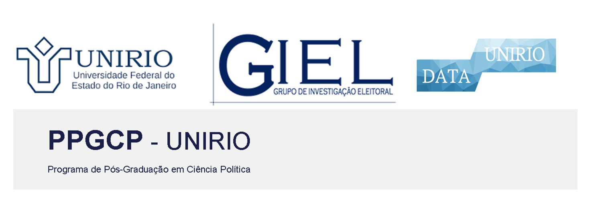

```{r setup, include=FALSE}
knitr::opts_chunk$set(echo = FALSE,message = FALSE, warning = FALSE,comment = NA)

options(digits = 2)
```

```{css, echo=FALSE}
  @import url('https://fonts.googleapis.com/css?family=Roboto&display=swap');
  body {
    font-family: 'Roboto';
  }
  h3::first-letter {
    font-size: 150%;
    line-height: 70px;
    color: white;
    background-color: blue;
  }
  h1,h2,h4,h5,h6 {
     font-family: 'Roboto', cursive;
  }
  h3,h4,h5,h6 {
     font-family: 'Roboto', cursive;
     color: white;
     background-color: blue;
  }

  

```
  


```{r,out.width = "100%",fig.align='center'}

```


## Carga Horária: 03 Horas

## Coordenadores:  Felipe Borba e Steven Ross

## Professor: Steven Dutt-Ross  (Departamento de Métodos Quantitativos - DATAUNIRIO)

## Local: CCJP/UNIRIO

## Dia: 09 de maio

## Horário: 09:00 às 12:00

# Plano de Ensino

### DESCRIÇÃO DO ENCONTRO

Os métodos digitais trouxeram uma nova abordagem para os processos de pesquisa em Humanas e Ciências Sociais. Nesse minicurso, apresentaremos um dos principais novos métodos: **Análise de Texto** como dado não estruturado. Assim, vamos analisar de forma prática os textos por meio de uma abordagem quantitativa. Discutiremos as principais abordagens de análise de texto. Os(as) alunos(as) irão utilizar dados e informações reais e serão capazes de construir visualizações de dados, a partir de registros brutos, além de avaliarem as características desses textos para extrair insights úteis.      
   
   
# Códigos 

DESENVOLVER 
   
   
# Base de dados 

### Excel

[https://github.com/GIEL-Investigacao-Eleitoral/analise_textos/raw/main/dados/excel/transcricao_grupo_de_foco.xlsx](https://github.com/GIEL-Investigacao-Eleitoral/analise_textos/raw/main/dados/excel/transcricao_grupo_de_foco.xlsx)


### RData

  
[https://github.com/GIEL-Investigacao-Eleitoral/analise_textos/raw/main/dados/rdata/frases_dom_casmurro.RDATA](https://github.com/GIEL-Investigacao-Eleitoral/analise_textos/raw/main/dados/rdata/frases_dom_casmurro.RDATA)

### Apresentação

DESENVOLVER

## OBJETIVO

O objetivo central do curso é promover a capacidade de criar códigos para análise de texto utilizando a linguagem de programação R.


*** 

## Programação

**1. Motivação** (25 minutos)     
1.  Matérias     
2.  Estudos de casos

***

**2. Termos e Conceitos** (35 minutos)

1.  Introdução ao texto como dado
2.  Conceitos Basicos: stopwords, corpus, token, lemma e stem

**3. Aplicação no R**  (2 horas)

1. Introdução/revisão de R  
2. Carregar dados de texto no R   
3. Limpeza de texto
4. Aplicação de Conceitos Basicos   
5. Análise de palavras: Frequência e Nuvem   
6. Análise de palavras: Tf-idf   
7. Relacionamento entre palavras: Bigramas e Trigramas
8. Análise de Emoji


### Bibliografia básica

ROSS, Steven Dutt; CRUZ, Breno de Paula Andrade. Análise quantitativa de textos: Apresentação e operacionalização da técnica via Twitter. Administração: Ensino e Pesquisa, v. 22, n. 1, 2021. Disponível em [https://raep.emnuvens.com.br/raep/article/view/1859/419](https://raep.emnuvens.com.br/raep/article/view/1859/419)

SILGE, Julia; ROBINSON, David. Text mining with R: A tidy approach. " O'Reilly Media, Inc.", 2017. Disponível em [https://www.tidytextmining.com/index.html](https://www.tidytextmining.com/index.html)

<!--https://bookdown.org/davi_moreira/txt4cs2/processamento.html-->


### Bibliografia complementar

1. SAMPAIO, Rafael Cardoso et al. Muita Bardin, pouca qualidade: uma avaliação sobre as análises de conteúdo qualitativas no Brasil. Revista Pesquisa Qualitativa, v. 10, n. 25, p. 464-494, 2022.

2. WICKHAM, H. and GROLEMUND, G.*R for data science: import, tidy, transform, visualize, and model data.*" O'Reilly Media, Inc.", 2016.


